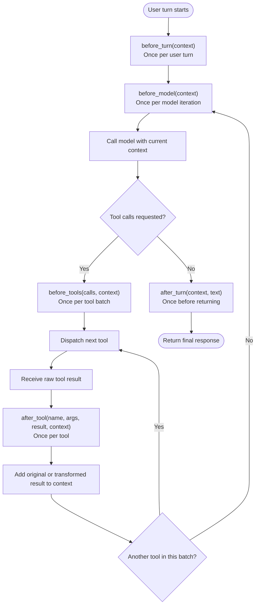

# Agent lifecycle hooks

The agent exposes five lifecycle seams. A user turn can contain multiple model
iterations, and each model iteration can contain a batch of multiple tool calls.

The Week 2 MUD integration currently uses the hooks as follows:

| Hook | Current responsibility |
|---|---|
| `before_turn` | Initialize or refresh player state, including the initial `check(score)`. |
| `before_model` | Establish the current position, survey unknown rooms, and inject current state. |
| `before_tools` | Poll asynchronous MUD output before dispatching a model-selected tool batch. |
| `after_tool` | Update memory from the result and optionally replace the value placed in model context. |
| `after_turn` | Provide a final seam immediately before the agent returns its response. |

The hook interface and its five call sites are described in
[`basic_memory.md`](./basic_memory.md). Observations of the hooks running in a
recorded session are documented in
[`observ_improvements.md`](./observ_improvements.md).
